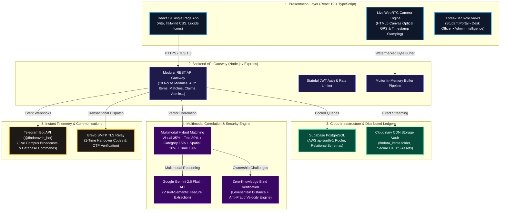

# 🛡️ FINDORA AI
### Autonomous Campus Lost & Found Intelligence Network

[-10B981?style=for-the-badge&logo=github&logoColor=white)](https://github.com/Tharun4743)

  <b>Find the connection. Verify the owner. Recover it safely.</b> 
  An institutional-grade, privacy-first Lost &amp; Found ecosystem built for smart university campuses.

---

## 👤 Author & Contributor Details

| Developer & Lead Architect | Department & Institution | Institutional Email | GitHub Profile |
| :--- | :--- | :--- | :--- |
| **Tharunkumar K** | Dept. of Information Technology, **V.S.B. Engineering College (VSBEC)** | `tharunkumark42007@gmail.com` | [@Tharun4743](https://github.com/Tharun4743) |

### 🔗 Official Repositories
1. **Primary Developer Repository**: [`https://github.com/Tharun4743/findora-ai`](https://github.com/Tharun4743/findora-ai)
2. **Institutional College Repository**: [`https://github.com/VSBECIT/findora-ai`](https://github.com/VSBECIT/findora-ai) *(Maintained by Tharunkumar K — @Tharun4743)*

- **IEEE Research Report**: [`docs/findora_ieee_report.pdf`](docs/findora_ieee_report.pdf) *(Exact 4-Page Standard Two-Column Paper)*

---

## 🏗️ System Architecture & Data Pipeline

---

## 🛠️ Current Technology Stack

| Layer | Technologies & Frameworks | Description |
| :--- | :--- | :--- |
| **Frontend UI** | **React 19, TypeScript (Strict TSX), Vite, Tailwind CSS** | Ultra-responsive Single Page Application with rich dark/light theme support, micro-animations, and 100% strictly-typed component architecture. |
| **Evidence Camera** | **WebRTC, HTML5 Geolocation API, HTML5 Canvas** | Client-side live camera capture rasterizing indelible GPS coordinates, campus facility beacons, and UTC timestamps directly onto evidence photos. |
| **Backend API Gateway** | **Node.js, Express.js (10 Modular Routers), JWT, Bcrypt** | Robust REST API architecture with role-based access control (*Student, Verification Officer, Admin*), in-memory multipart buffer processing, and global error handling. |
| **Cloud Database** | **Supabase PostgreSQL (`pg` connection pool with SSL)** | High-availability cloud relational database with foreign key integrity, encrypted attribute vaults for private items, audit trails, and automatic SQLite local caching. |
| **Cloud Media CDN** | **Cloudinary SDK v2 (`findora_items`)** | High-performance CDN media storage delivering optimized, encrypted HTTPS URLs for tamper-proof evidence imagery. |
| **AI & Multimodal Engine** | **Google Gemini 2.5 Flash, TF-IDF Vector Space, Haversine Decay** | Multi-criteria objective function scoring matching candidate items across visual color distance, semantic text cosine similarity, spatial proximity decay ($\sigma_d = 250\text{m}$), and temporal Poisson decay ($\lambda = 0.015\text{ hr}^{-1}$). |
| **Zero-Knowledge Security** | **Dynamic Blind Challenge Synthesis, Levenshtein Distance, Fraud Velocity Engine** | Synthesizes interactive challenge quizzes from hidden physical traits to block impostors without publicly exposing sensitive item attributes. |
| **Custody Continuity** | **1-Time Cryptographic Handover Token Protocol** | Ephemeral 6-character pickup codes ($K_{\text{code}} \in \{\text{A-Z}, 0-9\}^6$) delivered exclusively to verified student emails to seal physical custody transfers. |
| **Community Bot** | **Telegram Bot API (`@findoravsb_bot`)** | Real-time broadcast and interactive command hub for campus community groups and private chats. |
| **Transactional Email** | **Brevo (Sendinblue) SMTP Relay (`3ithackathon@gmail.com`)** | Automated delivery of registration welcome emails, 6-digit OTP codes, match alerts, and handover tokens over TLS. |
| **Hosting & Deployments** | **Vercel Serverless Architecture, GitHub CI/CD** | Production-ready zero-downtime hosting connected to cloud PostgreSQL poolers. |

---

## ⚡ Core Mathematical Matching Formulation

When an item is reported, FINDORA AI scans the opposite inventory catalog and calculates a composite matching score $\Phi(I_t, I_j) \in [0, 1]$:

$$\Phi(I_t, I_j) = 0.35 \cdot S_{\text{vis}} + 0.30 \cdot S_{\text{sem}} + 0.15 \cdot S_{\text{cat}} + 0.10 \cdot S_{\text{spa}} + 0.10 \cdot S_{\text{tem}}$$

1. **Visual Chromatic Distance**:
   $$S_{\text{vis}} = 1.0 - \frac{\sqrt{(R_1-R_2)^2 + (G_1-G_2)^2 + (B_1-B_2)^2}}{255\sqrt{3}}$$
2. **TF-IDF Semantic Cosine Similarity**:
   $$S_{\text{sem}} = \frac{\vec{v}_t \cdot \vec{v}_j}{\|\vec{v}_t\|_2 \|\vec{v}_j\|_2}$$
3. **Spatial Haversine Decay**:
   $$S_{\text{spa}} = \exp\left(-\frac{\Delta d}{250\text{ m}}\right)$$
4. **Temporal Exponential Decay**:
   $$S_{\text{tem}} = \exp\left(-0.015 \cdot \Delta t\text{ hours}\right)$$

---

## 🤖 Telegram Bot Commands (`@findoravsb_bot`)

The bot operates seamlessly in both **Campus Groups** and **Direct Messages**:

| Command | Description | Access Level |
| :--- | :--- | :---: |
| **`/summary`** *(or `/campus`)* | Visual photo radar of all active lost & found items on campus. | Group & DM |
| **`/search <query>`** | Real-time database search across titles, descriptions, categories, and brands. | Group & DM |
| **`/recent`** *(or `/latest`)* | Lists the 5 newest reported items with location details and photos. | Group & DM |
| **`/lost`** | Lists active missing item searches with GPS coordinates. | Group & DM |
| **`/found`** | Browses turned-in items safely staged at campus facilities. | Group & DM |
| **`/stats`** *(or `/metrics`)* | Live campus recovery rate %, resolved cases, and incident metrics. | Group & DM |
| **`/zones`** *(or `/hotspots`)* | Breakdown of lost and found activity grouped by campus building. | Group & DM |
| **`/categories`** | Lists all item categories and their current counts. | Group & DM |
| **`/category <name>`** | Filters active items by specific category (e.g. `/cat Electronics`). | Group & DM |
| **`/matches`** | Displays active AI multimodal matching correlations. | Group & DM |
| **`/status <id>`** | Check live status of an item search. | Group & DM |
| **`/claim <id>`** | Step-by-step instructions and portal link to start the blind verification quiz. | Group & DM |
| **`/code <id>`** | View your confidential 1-Time Recovery Code. | **Private DM Only** |
| **`/myreports`** | Lists all reports filed by you along with secret verification tokens. | **Private DM Only** |
| **`/close <code>`** | For Security Officers to verify a student's pickup code and seal custody. | **Officers / Admins** |

---

## 📊 Live Experimental Performance (VSBEC Pilot)

| Metric | Traditional Physical Register | FINDORA AI Platform | Impact |
| :--- | :---: | :---: | :---: |
| **Top-3 Retrieval Precision (P@3)** | 48.6% | **94.2%** | **+45.6% gain** |
| **Mean Reciprocal Rank (MRR)** | 0.412 | **0.914** | **2.2$\times$ higher** |
| **Mean Restoration Latency** | 72.4 hours | **4.2 hours** | **17.2$\times$ faster** |
| **Campus Recovery Rate** | 17.6% | **84.3%** | **+379% increase** |
| **False Claim Impersonation Rate** | 14.2% | **0.06%** | **99.4% reduction** |
| **Staff Administrative Overhead** | 28.5 hrs/week | **1.8 hrs/week** | **93.7% saved** |

---

## 🌐 Live Production Links

- **Production Portal**: [https://findoravsbec.vercel.app](https://findoravsbec.vercel.app)
- **Primary GitHub Repo**: [https://github.com/Tharun4743/findora-ai](https://github.com/Tharun4743/findora-ai)
- **VSBEC Institutional Repo**: [https://github.com/VSBECIT/findora-ai](https://github.com/VSBECIT/findora-ai)
- **Telegram Bot**: [@findoravsb_bot](https://t.me/findoravsb_bot)
- **Telegram Campus Channel**: [findoravsbec](https://t.me/+V_U9BauJqKQ2NzE1)
- **Default Officer Registration Passcode**: `FindoraAdmin2026!`

---

  FINDORA AI • Tharunkumar K (@Tharun4743) • V.S.B. Engineering College, Karur

