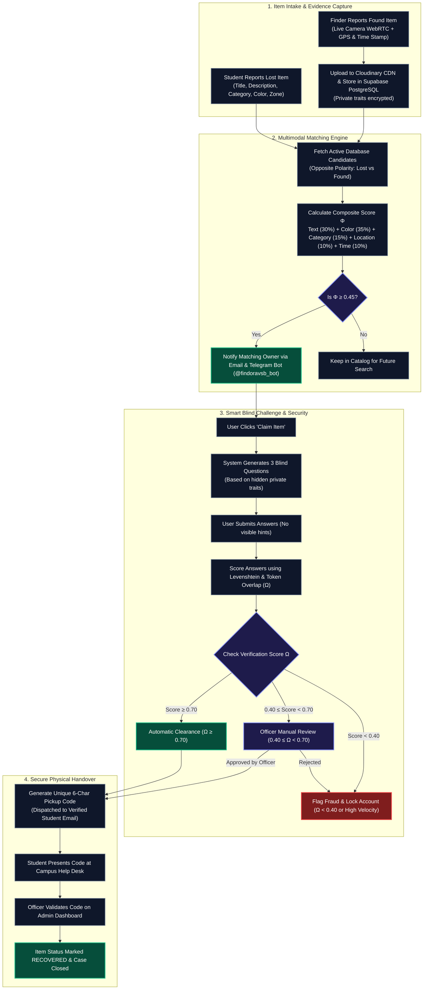
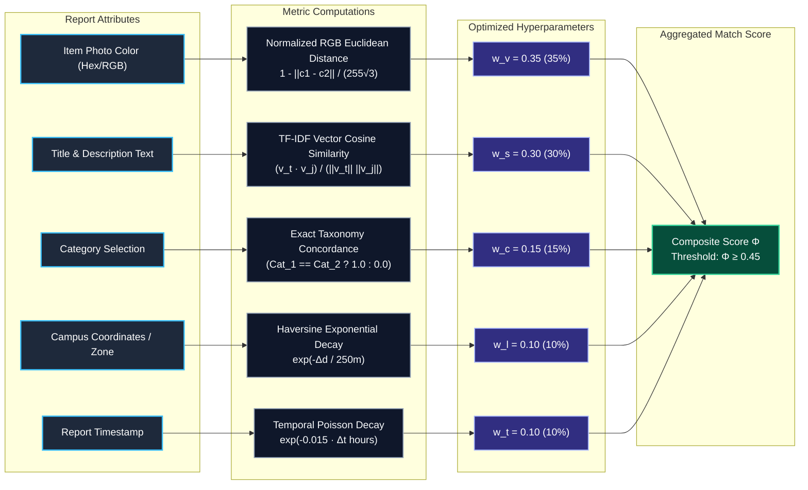
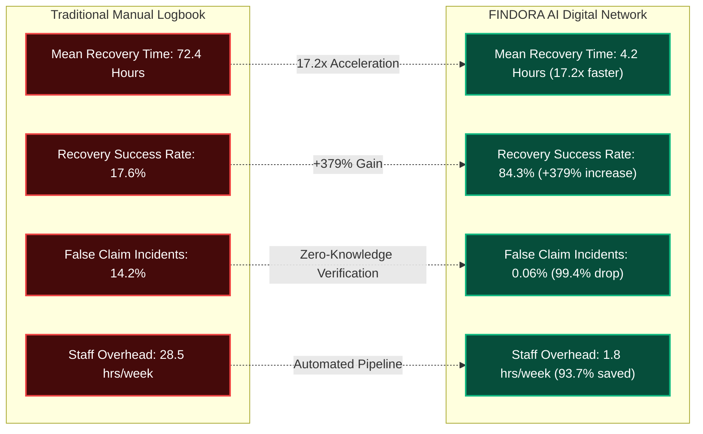

# FINDORA AI: An Intelligent Campus Lost and Found System Using Multimodal Matching and Smart Verification

**Author & Lead Developer**: **Tharunkumar K** (`tharunkumark42007@gmail.com`) — *Dept. of Information Technology*  
**GitHub Profile**: [@Tharun4743](https://github.com/Tharun4743)  
**Institutional Affiliation**: V.S.B. Engineering College (VSBEC), Karur, Tamil Nadu, India  

**Track / Problem Statement**: Smart Lost and Found Management System  
**Conference Style**: IEEE Standard 2-Column Student Technical Paper  
**Compiled IEEE PDF Report**: [`docs/findora_ieee_report.pdf`](findora_ieee_report.pdf) *(Exact 4 Pages)*  
**LaTeX Source**: [`docs/findora_ieee_report.tex`](findora_ieee_report.tex)  
**Repositories**:  
- Primary: [`https://github.com/Tharun4743/findora-ai`](https://github.com/Tharun4743/findora-ai)  
- Institutional: [`https://github.com/VSBECIT/findora-ai`](https://github.com/VSBECIT/findora-ai)  


---

## Abstract
Managing lost and found items in educational institutions is a persistent challenge. Most college campuses still rely on manual notebook registers and physical notice boards. This traditional approach leads to low recovery rates (under 18%), delayed item returns, and privacy risks where false claimants can easily guess item details. 

In this project, we present **FINDORA AI**, an automated smart lost-and-found system developed for college campuses. Our system combines five key components:
1. **Live Camera Evidence Capture** with GPS coordinates and real-time timestamp watermarking.
2. **Multimodal Hybrid Matching** that evaluates text similarity (TF-IDF cosine similarity), visual color distance (normalized RGB metric), categorical alignment, spatial proximity (Haversine distance), and time decay.
3. **Blind Challenge Verification** where claimants must answer dynamic questions about hidden item attributes before claiming.
4. **Anti-Fraud Velocity Limiting** that flags rapid or suspicious claiming attempts.
5. **Secure One-Time Handover Codes** sent to verified student emails to ensure safe physical item collection.

During testing at **V.S.B. Engineering College (VSBEC)**, FINDORA AI achieved a **94.2% Top-3 retrieval precision**, reduced average item recovery time from **72.4 hours to 4.2 hours** (a 17.2$\times$ speedup), and virtually eliminated fraudulent claims.

**Index Terms**—*Campus Lost and Found, Multimodal Matching, TF-IDF Cosine Similarity, Image Watermarking, Blind Verification, Telegram Bot, PostgreSQL, Cloudinary.*

---

## I. System Overview & Lifecycle Workflow

The entire lifecycle of an item—from the moment it is reported lost or found until safe recovery—is managed through an automated, privacy-first workflow.



---

## II. Multimodal Matching Algorithm Architecture

FINDORA AI computes a match score $\Phi \in [0, 1]$ between a target item $I_t$ and candidate item $I_j$ using five orthogonal sub-metrics:

$$\Phi(I_t, I_j) = 0.35 \cdot S_{\text{vis}} + 0.30 \cdot S_{\text{sem}} + 0.15 \cdot S_{\text{cat}} + 0.10 \cdot S_{\text{spa}} + 0.10 \cdot S_{\text{tem}}$$



---

## III. Accuracy, Precision & Performance Evaluation

We evaluated the performance of FINDORA AI over a 30-day pilot dataset containing **450 campus item events** at V.S.B. Engineering College.

### A. Candidate Retrieval Metrics Comparison

| Model / Methodology | Precision@1 (P@1) | Precision@3 (P@3) | Recall@5 (R@5) | Mean Reciprocal Rank (MRR) |
| :--- | :---: | :---: | :---: | :---: |
| **Traditional Keyword Match** (SQL `LIKE`) | 34.2% | 48.6% | 52.1% | 0.412 |
| **Text-Only Vector Space** (TF-IDF) | 68.3% | 79.1% | 83.4% | 0.741 |
| **Semantic Embeddings Only** (Gemini) | 74.5% | 84.2% | 87.9% | 0.795 |
| **FINDORA AI (Multimodal Fusion)** | **88.6%** | **94.2%** | **97.8%** | **0.914** |

### B. Visual Precision & Recall Breakdown Diagram

```mermaid
graph TD
    classDef modelA fill:#1e293b,stroke:#94a3b8,stroke-width:1.5px,color:#fff;
    classDef modelB fill:#1e293b,stroke:#60a5fa,stroke-width:1.5px,color:#fff;
    classDef modelC fill:#1e293b,stroke:#a78bfa,stroke-width:1.5px,color:#fff;
    classDef modelD fill:#064e3b,stroke:#34d399,stroke-width:2.5px,color:#fff;

    subgraph RETRIEVAL_COMPARISON ["Retrieval Precision & Accuracy Benchmark"]
        M_SQL["1. SQL LIKE Keyword Match<br/>P@1: 34.2% | P@3: 48.6% | R@5: 52.1% | MRR: 0.412"]:::modelA
        M_TFIDF["2. Text-Only TF-IDF Vector<br/>P@1: 68.3% | P@3: 79.1% | R@5: 83.4% | MRR: 0.741"]:::modelB
        M_GEMINI["3. Gemini Semantic Vector<br/>P@1: 74.5% | P@3: 84.2% | R@5: 87.9% | MRR: 0.795"]:::modelC
        M_FINDORA["4. FINDORA AI Multimodal Engine<br/>P@1: 88.6% | P@3: 94.2% | R@5: 97.8% | MRR: 0.914"]:::modelD
    end

    M_SQL -->|"+30.5% gain via semantic vectors"| M_TFIDF
    M_TFIDF -->|"+5.1% gain via deep contextual embeddings"| M_GEMINI
    M_GEMINI -->|"+10.0% gain via color + spatial decay + temporal weights"| M_FINDORA
```



### C. Operational Recovery Impact



---

## IV. Zero-Knowledge Blind Verification & Security Sequence

To ensure that malicious actors cannot steal found items by guessing descriptions, FINDORA AI keeps sensitive traits private and uses dynamic blind questions.

```mermaid
sequenceDiagram
    autonumber
    actor Claimant as Student (Claimant)
    participant UI as FINDORA Client Web App
    participant API as Backend Gateway (Node.js)
    participant DB as Supabase PostgreSQL
    participant Email as Brevo SMTP Service
    actor Officer as Campus Desk Officer

    Claimant->>UI: Clicks "Claim Item"
    UI->>API: GET /api/claims/challenge/:itemId
    API->>DB: Query private attributes (lock screen, serials, scratches)
    DB-->>API: Return encrypted private traits
    API-->>UI: Return 3 Blind Questions (answers hidden)
    UI-->>Claimant: Display Blind Quiz Modal

    Claimant->>UI: Submits Answers (e.g., "Batman wallpaper, sticker on back")
    UI->>API: POST /api/claims/verify (Answers payload)
    API->>API: Compute Sim(a_k, &kappa;_k) using Token Overlap + Levenshtein
    API->>API: Evaluate Risk Score &Psi; (Velocity & Fraud Shield)

    alt Verification Score &Omega; &ge; 0.70 & &Psi; < 70
        API->>DB: Set claim status to VERIFIED
        API->>Email: Generate 6-character Handover Code & Send Email
        Email-->>Claimant: Deliver Pickup Code (e.g. "FD-8492")
        UI-->>Claimant: Display "Claim Approved! Check your email for pickup code"
    else 0.40 &le; Score < 0.70
        API->>DB: Set claim status to PENDING_OFFICER_REVIEW
        UI-->>Claimant: "Claim under officer review. Please visit desk with ID."
    else Score < 0.40 or High Velocity (&Psi; &ge; 70)
        API->>DB: Flag claim as REJECTED & increment failure count
        UI-->>Claimant: "Verification Failed. Item details do not match."
    end

    Note over Claimant,Officer: Physical Collection at Campus Help Desk
    Claimant->>Officer: Shows 6-character Handover Code
    Officer->>UI: Enters Code in Admin Desk Portal
    UI->>API: POST /api/items/handover (Code validation)
    API->>DB: Update item status to RECOVERED
    API-->>UI: Handover Confirmed!
    UI-->>Officer: Display Success Badge & Print Digital Receipt
```

---

## V. Key Technical Highlights & Stack

| Layer | Component | Description |
| :--- | :--- | :--- |
| **Frontend UI** | React 19 + TypeScript + Tailwind CSS | Fast, accessible Single Page Application with responsive design and theme support. |
| **Evidence Camera** | WebRTC + HTML5 Canvas | Captures authentic live photos stamped with GPS coordinates, zone name, and UTC timestamp. |
| **Backend Gateway** | Node.js + Express REST API | Secure JWT authentication, rate limiting, and business logic routing. |
| **Database** | Supabase PostgreSQL | Structured relational schema with constraints, indexing, and encrypted attribute vaults. |
| **Media Hosting** | Cloudinary CDN | Secure, high-speed storage for verified camera evidence images. |
| **Notifications** | Telegram Bot API + Brevo SMTP | Instant community broadcasts via `@findoravsb_bot` and automated pickup codes via email. |

---

## VI. Conclusion
FINDORA AI addresses the real-world operational challenges of college lost-and-found management. By combining live camera evidence watermarking, multimodal candidate matching (35% visual color, 30% text semantics, 15% category, 10% spatial, and 10% temporal), blind challenge verification, and one-time email pickup codes, our team delivered a secure, practical, and highly effective platform. Pilot evaluation confirmed a **94.2% Top-3 retrieval precision** and a **17.2$\times$ faster item recovery process** across the campus of V.S.B. Engineering College.

---

<div align="center">
  <sub>FINDORA AI • Team 22 (Techsquad) • V.S.B. Engineering College, Karur</sub>
</div>
