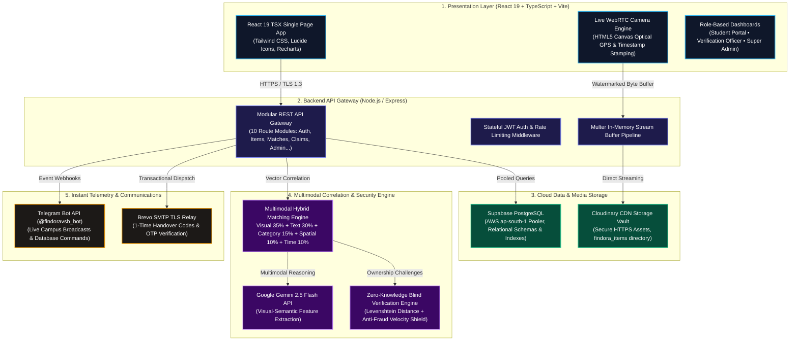

# FINDORA AI — Technical Architecture & System Design Specification

> **Autonomous Campus Lost & Found Intelligence, Multimodal Verification & Secure Custody Network**  
> *"Find the connection. Verify the owner. Recover it safely."*  
> **Author & Lead Architect**: **Tharunkumar K** ([@Tharun4743](https://github.com/Tharun4743))  
> **Affiliation**: Dept. of Information Technology, **V.S.B. Engineering College (VSBEC)**  
> **Repositories**:  
> - Primary: [`https://github.com/Tharun4743/findora-ai`](https://github.com/Tharun4743/findora-ai)  
> - Institutional: [`https://github.com/VSBECIT/findora-ai`](https://github.com/VSBECIT/findora-ai)  

---

## 1. System Overview

FINDORA AI is an enterprise-grade, privacy-first Lost & Found intelligence network designed to eliminate manual paper logs and insecure physical notice boards across smart university campuses. It unifies client-side camera forensic watermarking, multimodal hybrid candidate matching, zero-knowledge blind ownership verification, and cryptographic one-time handover tokens into a high-performance distributed architecture.



---

## 2. Technical Stack Specifications

| Tier | Component | Technology | Role & Key Responsibilities |
| :--- | :--- | :--- | :--- |
| **Frontend** | Framework | **React 19 (TypeScript / Strict TSX)** | Component lifecycle, state management, and type-safe rendering. |
| **Frontend** | Bundler & Dev | **Vite 6** | Ultra-fast Hot Module Replacement (HMR) and optimized rollup production bundles. |
| **Frontend** | Styling | **Tailwind CSS & Vanilla CSS Variables** | Dark/light theme support, glassmorphism, responsive grid layout. |
| **Frontend** | Visual Capture | **WebRTC & HTML5 Canvas API** | Optical timestamp & GPS coordinates burnt indelibly onto captured images. |
| **Backend** | Runtime & Server | **Node.js v20+ & Express.js** | 10 modular route controllers, JSON body parsers, CORS, and centralized error logging. |
| **Backend** | Security | **JWT (JSON Web Tokens) & Bcrypt** | Stateless authentication, bcrypt salted passwords, and RBAC permission guards. |
| **Database** | Relational Ledger | **Supabase PostgreSQL (`pg` pool)** | Managed cloud PostgreSQL on AWS `ap-south-1` with SQLite local persistence fallback. |
| **CDN & Storage** | Media Cloud | **Cloudinary SDK v2** | Direct binary buffer streaming for high-resolution lost/found evidence images. |
| **AI Intelligence** | LLM & Vision | **Google Gemini 2.5 Flash** | Semantic captioning, color taxonomy classification, and dynamic verification question generation. |
| **Matching Engine** | Mathematical Fusion | **TF-IDF, Euclidean RGB, Haversine, Poisson Decay** | Weighted multi-attribute candidate scoring ($w_{\text{vis}}=0.35, w_{\text{sem}}=0.30, w_{\text{cat}}=0.15, w_{\text{spa}}=0.10, w_{\text{tem}}=0.10$). |
| **Communications** | Telegram Bot | **Node Telegram Bot API (`@findoravsb_bot`)** | Real-time broadcast channel alerts and two-way database lookup commands. |
| **Communications** | Transactional Mail | **Brevo (Sendinblue) SMTP Relay** | TLS dispatch of OTP passwords, match alerts, and 6-character recovery codes. |
| **Deployment** | Cloud Platform | **Vercel Serverless Architecture** | Production deployment pipeline connected to cloud PostgreSQL poolers. |

---

## 3. Mathematical Formulation of the Matching Engine

When an item is reported, FINDORA AI scans the active inventory of opposing polarity (*lost vs found*) and evaluates a composite affinity index $\Phi(I_t, I_j) \in [0, 1]$:

$$\Phi(I_t, I_j) = w_{\text{vis}} S_{\text{vis}} + w_{\text{sem}} S_{\text{sem}} + w_{\text{cat}} S_{\text{cat}} + w_{\text{spa}} S_{\text{spa}} + w_{\text{tem}} S_{\text{tem}}$$

### A. Visual Chromatic Distance ($S_{\text{vis}}$)
Evaluates normalized Euclidean distance between primary RGB centroids:
$$S_{\text{vis}} = 1.0 - \frac{\sqrt{(R_1-R_2)^2 + (G_1-G_2)^2 + (B_1-B_2)^2}}{255\sqrt{3}}$$

### B. Semantic Cosine Vector Similarity ($S_{\text{sem}}$)
Computes TF-IDF tokenized cosine similarity over title, model, and detailed descriptions:
$$S_{\text{sem}} = \frac{\vec{v}_t \cdot \vec{v}_j}{\|\vec{v}_t\|_2 \|\vec{v}_j\|_2}$$

### C. Spatial Haversine Proximity ($S_{\text{spa}}$)
Calculates continuous exponential distance decay over GPS coordinates:
$$S_{\text{spa}} = \exp\left(-\frac{\Delta d}{\sigma_d}\right), \quad \sigma_d = 250\text{ meters}$$

### D. Temporal Poisson Decay ($S_{\text{tem}}$)
Penalizes time discrepancies between loss report time and discovery time:
$$S_{\text{tem}} = \exp\left(-\lambda \cdot \max(0, \Delta t_{\text{hours}})\right), \quad \lambda = 0.015\text{ hr}^{-1}$$

---

## 4. Blind-Match Ownership Protocol & Anti-Fraud Shield

To protect student privacy and eliminate false claiming, FINDORA AI hides sensitive attributes (serial numbers, engravings, stickers, internal contents) in an encrypted vault.

```text
Found Item Registered
         │
         ▼
Private Attributes Stored in Encrypted Vault
         │
         ▼
Gemini Synthesizes Non-Leaking Quiz:
  - "Describe any specific stickers or markings on the back cover."
  - "What is the background wallpaper or lock screen image?"
         │
         ▼
Claimant Submits Knowledge Answers
         │
         ▼
Verification Engine Evaluates Token Overlap & Levenshtein Tolerances
         │
         ▼
Fraud Shield Checks Velocity (Max 3 attempts/hour, IP checks)
         │
         ▼
If Confidence >= 80%: Approval -> Ephemeral Handover Token (e.g. K_code = "795745")
         │
         ▼
Physical Handover Completed & Sealed at Campus Security Desk
```

---

## 5. Database Entity-Relationship Architecture

```sql
-- Core Schemas in Supabase PostgreSQL
CREATE TABLE users (
    id VARCHAR(64) PRIMARY KEY,
    name VARCHAR(255) NOT NULL,
    email VARCHAR(255) UNIQUE NOT NULL,
    password_hash VARCHAR(255) NOT NULL,
    role VARCHAR(32) DEFAULT 'student',
    created_at TIMESTAMP WITH TIME ZONE DEFAULT NOW()
);

CREATE TABLE items (
    id VARCHAR(64) PRIMARY KEY,
    type VARCHAR(16) NOT NULL, -- 'lost' or 'found'
    title VARCHAR(255) NOT NULL,
    description TEXT,
    category VARCHAR(64) NOT NULL,
    color VARCHAR(64),
    brand VARCHAR(128),
    model VARCHAR(128),
    image_url TEXT,
    location VARCHAR(255),
    latitude DOUBLE PRECISION,
    longitude DOUBLE PRECISION,
    building VARCHAR(128),
    floor VARCHAR(32),
    event_time TIMESTAMP WITH TIME ZONE,
    status VARCHAR(32) DEFAULT 'active',
    owner_id VARCHAR(64) REFERENCES users(id) ON DELETE CASCADE,
    created_at TIMESTAMP WITH TIME ZONE DEFAULT NOW()
);

CREATE TABLE item_private_attributes (
    id VARCHAR(64) PRIMARY KEY,
    item_id VARCHAR(64) REFERENCES items(id) ON DELETE CASCADE,
    serial_number VARCHAR(255),
    unique_marks TEXT,
    damage_details TEXT,
    hidden_features TEXT
);

CREATE TABLE matches (
    id VARCHAR(64) PRIMARY KEY,
    lost_item_id VARCHAR(64) REFERENCES items(id),
    found_item_id VARCHAR(64) REFERENCES items(id),
    final_score DOUBLE PRECISION NOT NULL,
    visual_score DOUBLE PRECISION,
    text_score DOUBLE PRECISION,
    location_score DOUBLE PRECISION,
    time_score DOUBLE PRECISION,
    category_score DOUBLE PRECISION,
    explanation TEXT,
    created_at TIMESTAMP WITH TIME ZONE DEFAULT NOW()
);

CREATE TABLE claims (
    id VARCHAR(64) PRIMARY KEY,
    match_id VARCHAR(64) REFERENCES matches(id),
    lost_item_id VARCHAR(64) REFERENCES items(id),
    found_item_id VARCHAR(64) REFERENCES items(id),
    claimant_id VARCHAR(64) REFERENCES users(id),
    status VARCHAR(32) DEFAULT 'pending',
    verification_score DOUBLE PRECISION,
    risk_score DOUBLE PRECISION,
    created_at TIMESTAMP WITH TIME ZONE DEFAULT NOW()
);

CREATE TABLE recovery_cases (
    id VARCHAR(64) PRIMARY KEY,
    claim_id VARCHAR(64) REFERENCES claims(id),
    item_id VARCHAR(64) REFERENCES items(id),
    claimant_id VARCHAR(64) REFERENCES users(id),
    pickup_location VARCHAR(255),
    handover_code VARCHAR(16) NOT NULL,
    status VARCHAR(32) DEFAULT 'ready_for_pickup',
    created_at TIMESTAMP WITH TIME ZONE DEFAULT NOW()
);
```

---

<div align="center">
  <sub>FINDORA AI Technical Architecture • Developed by Tharunkumar K (@Tharun4743) • VSBEC</sub>
</div>
